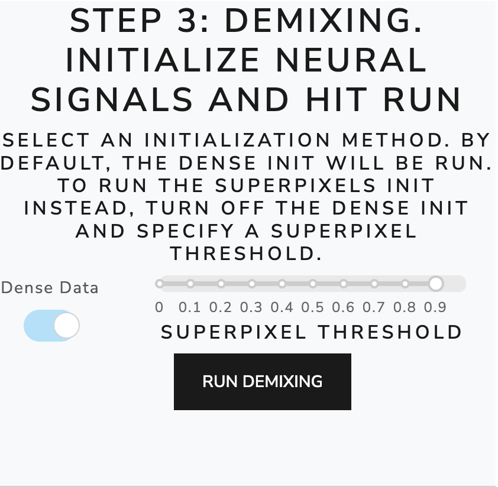
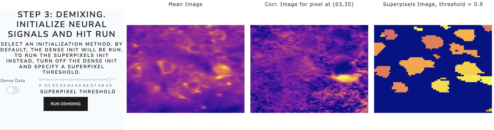
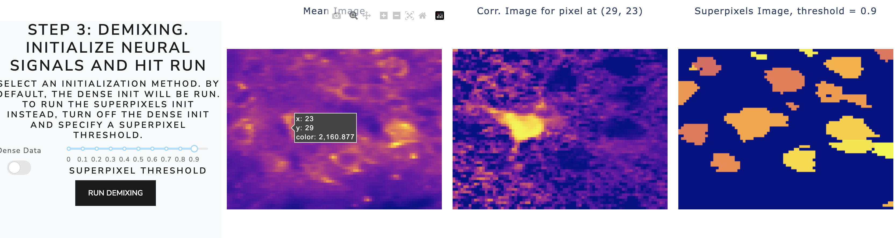
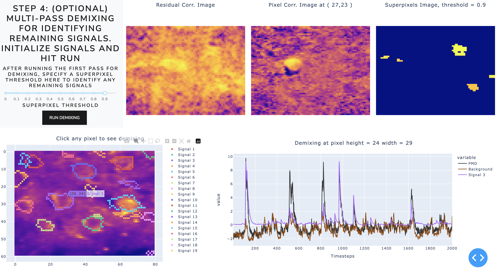
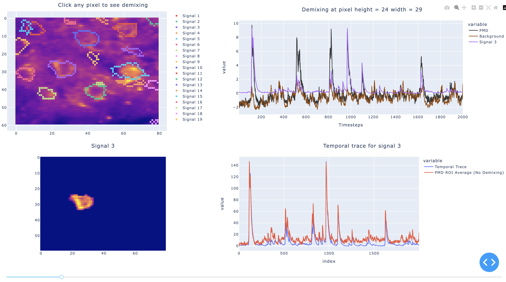

.. maskNMF demixing guide

Demixing Analyses
=================

As soon as the Preprocessing (motion correction and compression) steps have completed, the next stage is to idenify ROIs and demix them from the PMD compressed data. Conceptually, this stage can be broken into two steps: ROI identification and signal demixing. Through the Dash app, you can quickly and interactively go back and forth between these two stages in a "multi-pass" strategy. This allows you to initialize one set of cells, unmix these signals, and then repeat the process on the "residual" data (the data formed by subtracting off the cells you have already initialized from the PMD compressed representation of the movie). 

**Step 1: ROI Identification**

There are two initializations options you can use. You can use the superpixels approach first defined in Buchanan et al. (which is a local correlation based algorithm for identifying active cells) or the maskNMF cell initialization pipeline, called "Dense Data" in the app: 

The maskNMF initializattion was designed with for denser, volumetric imaging in mind but also works well for sparse, soma-targeted data. Note that the "Dense Data" initialization is meant to be used for the first pass through the data; all subsequent passes use superpixel initialization. To use the superpixels approach, first turn off the Dense Data switch. Then, the app enables a correlation threshold which you can interactively toggle to see how different correlation values affect the neural signal initialization, like so: 

To better understand the local correlation structure of the data, you can click on individual pixels of the data and how this pixel is temporally correlated with the rest of the pixels in the movie, like so:

   
You can use this tool to understand what a reasonable superpixel correlation threshold might look 

**Step 2: Demixing, Multipass Strategy, and Interactive Plots**

After completing the cell initialization, click "run demixing" to kick off the localNMF demixing algorithm. Once this step is complete, you can inspect the results in interactive summary plots (see below). The expected workflow is to first run Step 1 and Step 2. Then, you can use the visualization tools within the Dashboard to run subsequent passes of the algorithm.  Note that subsequent passes will be via the superpixel initialization. See, for example, the results of running one pass of demixing: 

   
The correlation figures from the multi-pass demixing section (Step 4 in the above figure) show a residual movie whose local correlation images suggest there are remaining cells. We can confirm this by clicking a pixel where we think there may be missed signal in the interactive summary plot below step 4. The time series corresponding time series plots show that the PMD trace (in black) is not being adequately tracked by "Signal 3". There should be another neural signal, and by identifying this cell in the multi-pass strategy we can achieve more accurate demixing. 

We also provide another interactive plot which allows the user to scroll through the individual ROIs:

The second panel provides an option to scroll through each ROI individually and examine its estimated temporal trace. Here we show the estimated temporal trace from our algorithm and the result of performing an unweighted ROI average of this cell, to give the user a clear idea of how well the demixing algorithm is removing neuropil contamination and tracking the signal properly. Note that the ordering of the ROIs here corresponds to the ROIs from the first panel. 