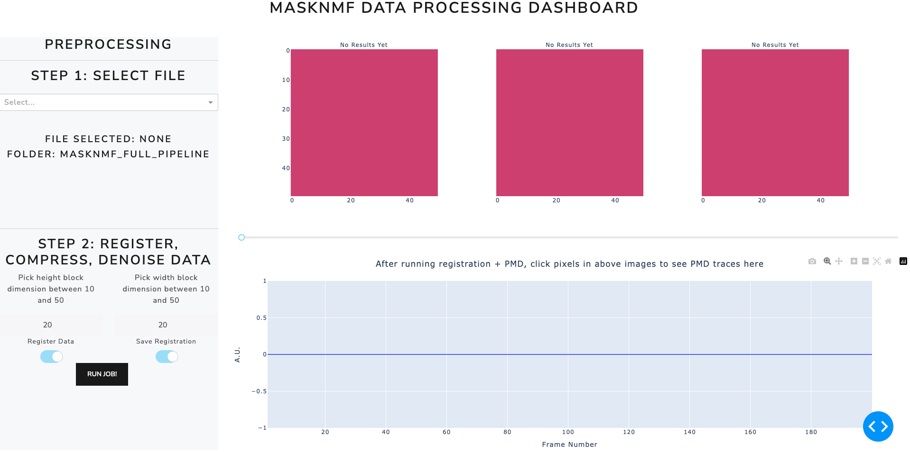

.. maskNMF pre-processing guide

Motion correction, Compression, Inspection
==========================================

In this section, we focus on the steps to preprocess data in the maskNMF app. See the below image for how this part of the app looks at the beginning. It is assumed that you are launching the app from the docker container (as detailed in the "Installation" section). 

The first step is to select the file to analyze. If you are launching this app through the official docker container, that means you really selected the data when you launched the app - in this case, the dataset will be found in the "mounted_data" folder. You can use the file selection bar (under "Step 1") to browse through the app filesystem and select it.

We now discuss the three ways you can use these preprocessing tools. In all cases, PMD Compression will be run. For PMD, there are two parameters to select: the "X" and "Y" block dimensions. At a high level, the PMD algorithms partitions the imaging FOV into overlapping blocks, runs a variant of truncatetd singular value decomposition on each block of the data, and then collates the results. The block dimensions should be at least (20, 20) and at most (100, 100). Each block should be large enough to cover a single neural signal (for example, a soma). However, before the compression is run, there are options to register the data as well.

**Approach 1**: You run motion correction, save results, then run PMD Compression
Here you register the data and guarantee that the results are explicitly saved out as another tiff file. Doing so will allow you to visualize motion corrected traces of the data and compare them to the traces of the data after the PMD compression step. 

**Approach 2**: You run motion correction + PMD Compression on the fly without saving intermediate data. This approach essenially performs end-to-end motion correction + compression on the GPU. It is a hyper-efficient way to compress data. You will not be able to compare motion traces here with the PMD outputs here, but this approach should be used for time-constrained instances involving big data (for e.g. online adaptive experimentation). 

**Approach 3**: You do not run motion correction and directly compress the PMD video. You can consider taking this approach if, for example, the data has already been registered or if there is minimal motion due to experimental settings. Taking this approach will allow you to also do a direct comparison between the raw data and the compressed outputs. 

Here is how the results will look after you have run all of these steps: 

<image>

First note that you can use the closed-loop selection annotation tools to look at ROI-averaged traces in the PMD movie (and motion corrected/raw movie, where applicable). Otherwise you can also click individual pixels of this data to look at the corresponding traces. 

You can also use the scroll bar to look at individual frames of the raw/motion corrected and PMD compressed video. In general, the Dash app is meant to function as a Dashboard for kicking off jobs and creating lightweight visualizations, so you won't get high-framerate playback of these videos on the app. For this purpose, we have built a napari plugin to allow you to do this with the massively compressed data on your personal computer. 