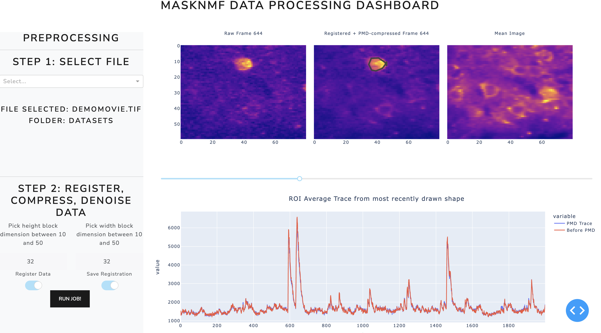
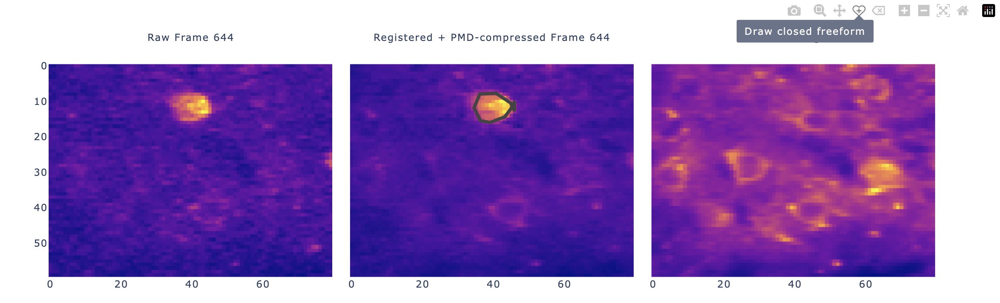

.. maskNMF pre-processing guide

Motion correction, Compression, Inspection
==========================================

In this section, we focus on the steps to preprocess data in the maskNMF app. See the below image for how this part of the app looks at the beginning. It is assumed that you are launching the app from the docker container (as detailed in the "Installation" section). 

.. image:: ../images/Preprocessing_MaskNMF.png
   :width: 600

The first step is to select the file to analyze. If you are launching this app through the official docker container, that means that in Step 3 of the Installation Guide, you specified the dataname already. The app automatically makes this file visible in the "mounted_data" folder of the Docker Filesystem. You can use the file selection bar (under "Step 1") to browse through the app filesystem and select it.

Motion stabilized imaging data is critical for all subsequent data analysis in this pipeline - results will not be accurate if there is drift or motion in the image series. There are three ways to run motion correction (detailed below). After this, the next step is to run PMD data compression of the registered data. PMD Compression is an essential preprocessing step in our pipeline, allowing for faster data analysis and conservative noise reduction. For PMD, there are two parameters to select: a block height and a block width. At a high level, the PMD algorithms partitions the imaging FOV into overlapping blocks, runs a variant of truncated singular value decomposition on each block of the data, and then collates the results. As a general rule of thumb, the block dimensions should be at least (20, 20) and at most (50, 50). Each block should be large enough to cover a single neural signal (for example, a soma). Note that the default values in the picture above are (20, 20). 

Before running compression, however, you need to specify whether to run motion correction and whether to save out the motion corrected movie. There are three approaches to doing this: 

**Approach 1**: You do not run motion correction and directly compress the PMD video. You can consider taking this approach if, for example, the data has already been registered or if there is minimal motion due to experimental settings. Taking this approach will allow you to do a direct comparison between the raw data and the compressed outputs. 

**Approach 2**: You run motion correction, save results, then run PMD Compression
Here you register the data and guarantee that the results are explicitly saved out as another tiff file. Doing so will allow you to visualize motion corrected traces of the data and compare them to the traces of the data after the PMD compression step. 

**Approach 3**: You run motion correction + PMD Compression on the fly without saving intermediate data. This approach essenially performs end-to-end motion correction + compression on the GPU. It is a hyper-efficient way to compress data. You will not be able to compare motion traces here with the PMD outputs here, but this approach should be used for time-constrained instances involving big data (for e.g. online adaptive experimentation). 

Here is how the results will look after you have run all of these steps: 

The app provides functionality for convenient viewing: you can zoom in and out of any of the images, you can use the scroll bar to scroll through frames of the individual movie (more on this below), and you can do the same kinds of things for the temporal traces. Note in the "Registered and Compresed PMD Frame" panel, there is a black drawing over the prominent cell. The Dash app allows for manual ROI selection; upon drawing an ROI, the ROI averaged PMD and/or raw traces will be generated. This can be useful for quickly examining the quality of a dataset before doing further analysis. You can also do this at the single-pixel level; by selecting the "zoom" feature (see below) and clicking a pixel, the app will automatically show you the PMD and (if applicable) raw traces of the data. In general, by hovering your cursor over all the figures, you can see the different ways in which you can interact with the figure (zooming in/out, annotations, and more). See the below image for an illustration: 

Dash apps generally aren't efficient for video rendering, and that isn't the purpose of this app.  This app is for fast and efficient preprocessing and inspection of extracted sources.   We know, however, that inspection of final processed images/movies is a critical component of data inspection, so we have created an export feature and a napari plugin to view these compressed movies locally on your personal computer very efficiently.  We also provide a minimal set of python scripts to convert the compressed image series into a traditional format, like tiff, for inspection in any standard tool.  We note, however, that this last step will generate a large movie, of comparable size to the original raw data.